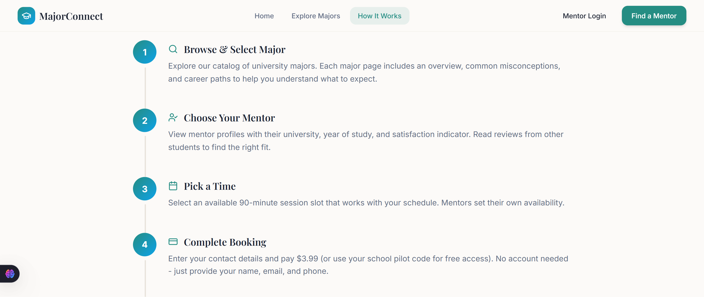
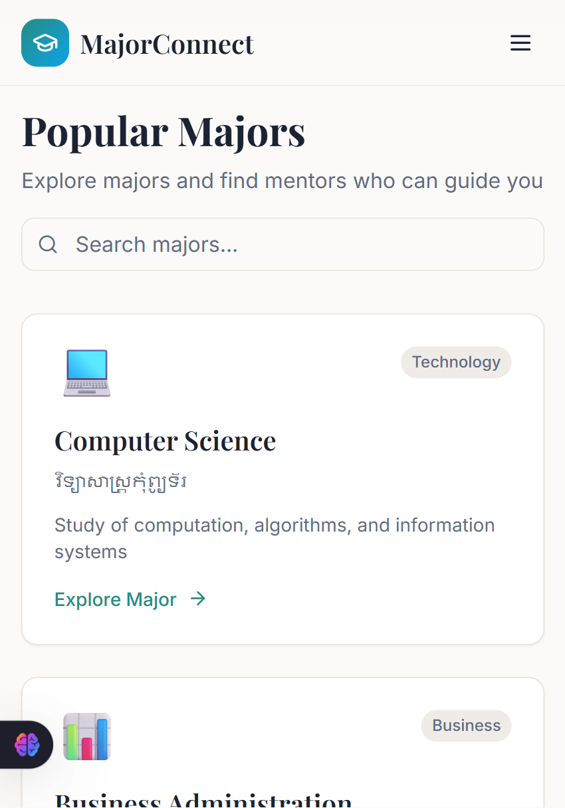

Major Connect Hub

A modern, user-friendly platform connecting high school students with real university students
who can give them honest, firsthand insights about their majors.

📌 Table of Contents

- [About](#about)
- [Demo](#demo)
- [Features](#features)
- [How It Works](#how-it-works)
- [Screenshots](#screenshots)
- [Tech Stack](#tech-stack)
- [Installation](#installation)
- [Usage](#usage)

## 🧠 About

Major Connect Hub is a front-end web application designed to connect high school students with real university students who can give them honest, firsthand insights about their majors through one-on-one discussions.

## 🖥 Demo

Access the live demo here:
🔗 https://sousdeykim.github.io/major-connect-hub/

## ✨ Features

🎯 Clear breakdown of how the platform works

📊 Visual guidance for students choosing a major

🔎 Easy-to-understand user flow and navigation

📱 Responsive layout for different screen sizes

## 🚀 How It Works

Step 1: Student selects a major and mentor
Step 2: Student enters contact info (no account needed)
Step 3: Student books a session (paid or free pilot)
Step 4: System generates a unique session code
Step 5: Email is sent with mentor contact and session details
Step 6: Mentor and student meet via Google Meet
Step 7: Session completion confirmation
Step 8: Student submits feedback and review

## 📸 Screenshots

Below are some screenshots of the project:

Homepage

 

How It Works Section

Mobile View

## 🛠 Tech Stack
Category Technology
Frontend HTML, CSS, JavaScript
Library React
Hosting GitHub Pages

## 💻 Installation

If someone wants to clone and run the project locally:

# Clone the repo

git clone https://github.com/SousdeyKim/major-connect-hub.git

# Change directory

cd major-connect-hub

# Install dependencies

npm install

# Run locally

npm run dev 

## ⚙ Usage

Open the project in your code editor

Make changes in src/ (or where your pages/components are)

Run the development server

Build for production when ready
